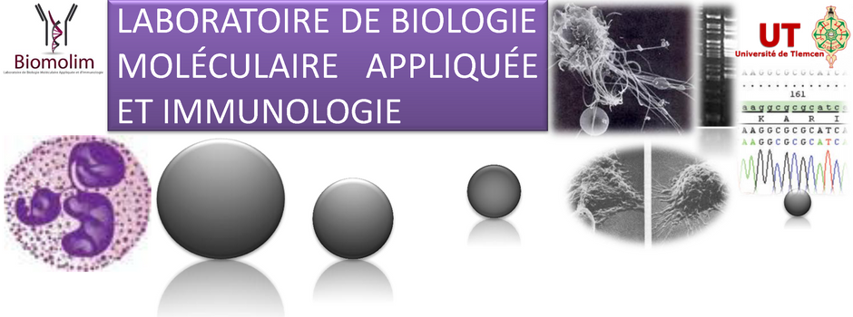

---
title: IIIème workshop du laboratoire BIOMOLIM - Immunoinformatique - Analyse du transcriptome
  par approches haut-débit.
author: ''
date: "29 mai au 2 juin - Auditorium de la faculté SNV-TU - Algérie."
output:
  html_document:
    theme: cerulean
    toc: no
    toc_depth: 4
  pdf_document:
    toc: yes
    toc_depth: '4'
  word_document:
    toc: yes
    toc_depth: '4'
bibliography: bibliography.bib
---

 
 

| || |
|----------------- |--|--------------------|
||&nbsp;&nbsp;&nbsp;&nbsp;&nbsp;&nbsp;&nbsp;||

 
 

## Organisateurs

- Dr. Salvatore SPICUGLIA

- Pr. Mourad ARIBI

## Equipe pédagogique

- Salvatore Spicuglia (Chercheur Inserm, TAGC, Marseille)
- Denis Puthier (Maitre de Conférences Aix-Marseille Université, TAGC, Marseille)
- Eve-Lyne Mathieu (Ingénieur de Recherche Inserm, TAGC, Marseille)
- Mohamed Belhocine (doctorant, Aix-Marseille Université, TAGC, Marseille)
- Yasmina Kermezli (doctorante, Université de Tlemcen)
- Wiam Saadi (doctorante, Université de Tlemcen)
- Lynda Klouche (BIOMOLIM, Université de Tlemcen)
- Djamel Smahi (BIOMOLIM, Université de Tlemcen)
- Warda Meziane (BIOMOLIM, Université de Tlemcen)
- Zeyneb Hadjidj (BIOMOLIM, Université de Tlemcen)
- Zineb Mekkaoui (BIOMOLIM, Université de Tlemcen)
- Sana Boualitabet Helal (BIOMOLIM, Université de Tlemcen)

------------------------------------------------------

## Programme

Vous trouverez ci-dessous le programme des enseignements. Ils auront lieu chaque jour jusqu'à 18h.

**Dimanche 29 Mai**

|Horaire|Contenu
|----|---------------------------------------------------
|9h00| Mots d'ouverture (Pr. Mourad)
|9h20| Présentation du workshop et introduction générale (Spicuglia/Mathieu/Puthier)
|10h30| Pause café
|10h45| Introduction à l'étude de l'ARN et les techniques associées (Spicuglia/Puthier)
|12h00| Déjeuner
|13h30| Traitement de données RNA-seq I (Puthier/Belhocine/Kermezli)
|15h15| Pause café
|15h30| Traitement de données RNA-seq II (Puthier/Belhocine/Kermezli)

**Lundi 30 Mai**

|Horaire|Contenu
|----|----------------------------------------------------
|9h00| Cours théorique sur la régulation épigénétique au cours du développement et des maladies (Spicuglia)
|10h30| Pause café
|10h45| Quantification de l'expression de gènes (Puthier/Belhocine/Kermezli)
|12h00| Déjeuner
|13h30| Identification de gènes différentiellement exprimés I (Puthier/Belhocine/Kermezli)
|15h15| Pause café
|15h30| Visualisation des données RNA-seq (Puthier/Belhocine/Kermezli).

**Mardi 31 Mai**

|Horaire|Contenu
|----|----------------------------------------
|9h00| Cours théorique. LncRNAs| Rôles régulateurs dans le système immunitaire (Mathieu)
|10h30| Pause café
|10h45| Préparation du cDNA (Mathieu/Saadi)
|12h00| Déjeuner
|13h30| Etude de l'expression des gènes par PCR (Mathieu/Saadi)
|15h15| Pause café
|15h30| 

**Mercredi 01 juin**

|Horaire|Contenu
|----|-------------------------------------------
|9h00| Analyse de résultats de PCR par électrophorèse sur gel d'agarose (Mathieu/Saadi)
|10h30| Pause café
|10h45| Révélation de résultats (Mathieu/Saadi)
|12h00| Déjeuner
|13h30| Interprétation des résultats de PCR (Mathieu/Saadi)
|15h15| Pause café
|15h30| Etude des Voies de régulation affectées (Puthier/Belhocine/Kermezli)

**Jeudi 02 Juin**

|Horaire|Contenu
|----|-----------------------------------------------------
|9h00| Etude des Voies de régulation affectées (Puthier/Belhocine/Kermezli)
|10h30| Pause café
|10h45| Rédaction d&#39;un rapport synthétique
|12h00| Déjeuner
|13h30| Discussion ouverte
|15h15| Pause café
|15h30| Conclusions
|20h00| Diner de clôture

------------------------------------------------

## Introduction
### Les nouvelles méthodes de séquençage

Aujourd'hui, l'avènement des méthodes de séquençage haut débit ("high throughput sequencing"", HTS) permet d'analyser systématiquement les différentes espèces d'acides nucléiques (ADN et ARN) présentes  dans une population cellulaire et d'analyser les interactions que celles-ci entretiennent avec les protéines régulatrices. Parmi les méthodes développées, le RNA-Seq permet une analyse systématique des transcrits présents dans un échantillon biologique donné. Les applications de cette téchnologie sont nombreuses notamment dans le domaine de la santé et de la recherche fondamentale. Ainsi, des travaux récents menés dans le cadre du projet ENCODE (ENCyclopedia Of  DNA Elements) montrent qu'une large fraction du génome humain (au moins 74%) a la propriété de pouvoir être transcrite. L'analyse des transcrits découverts par RNA-Seq montre qu'une large partie des transcrits sont relativement long et sans doute non-codant. On les a par conséquent classé dans la catégorie des 'Long non-coding RNAs' (lncRNAs). Ces lncRNAs sont faiblement abondants, très tissus-spécifiques et la détermination de leur fonction reste un défit majeur pour les années à venir. 

### Objectif 

Dans le cadre de cette formation nous vous proposons de partir sur les traces de ces nouveaux ARNs en réalisant les étapes d'analyses bioinformatiques d'échantillons RNA-Seq.  Cette analyse sera suivie d'une validation des découvertes effectuées en utilisant la méthode de RT-PCR.

### Le modèle biologique
#### Le thymus

Le thymus est un organe lymphoïde primaire où se déroule la maturation lymphocytaire T. Il coordonne les événements qui conduisent à la formation d’un répertoire de lymphocytes T fonctionnels à partir de cellules souches hématopoïétiques.  La maturation lymphocytaire T est sous l’étroit contrôle du microenvironnement thymique constitué de cellules stromales appelées aussi cellules « résidentes » (Anderson, 2000). Au cours de leur migration dans le thymus, les thymocytes subissent de nombreuses étapes de différenciation caractérisées par des changements phénotypiques successifs. Ainsi, la différenciation des thymocytes est définie principalement par l’expression des marqueurs CD4 et CD8 et le degré de réarrangement des différents gènes codant pour le TCR (T cell receptor). Dans le thymus adulte, on peut définir trois grandes populations cellulaires: CD4-CD8- (double négatif DN, 5% du pool total des thymocytes), CD4+CD8+ (double positif DP, 80%) et CD4+ ou CD8+ (simple positif SP, 15%) (Fig 1). 

#### la lignée P5424

L’analyse des premières étapes de la différenciation T est rendue difficile par la faible représentation des précurseurs thymiques dans le thymus de la souris adulte. Afin de pouvoir analyser les processus de différenciation thymocytaire il est intéressant de pouvoir disposer de cellules immortalisées (lignées)  pouvant être manipulées in-vitro. Dans un article de 1995, Monbaertz a décrit l’obtention de lignées cellulaires après croisements entre souris Knock-Out (KO)  pour les gènes P53 et pour le gène RAG1 (Mombaerts et al, 1995). Dans ces souris P53°/RAG°, la différenciation thymocytaire est bloquée au stade DN3 (effet de l’invalidation du gène RAG) et la délétion de P53 s’accompagne de nombreuses tumeurs. Il est donc très probable d’obtenir sur ce fond génétique des lignées cellulaires correspondant à des précurseurs T DN (qui sont très nombreux dans le thymus de souris RAG1°). Les auteurs ont obtenu par cette approche une lignée cellulaire nommées P5424. L’analyse des marqueurs de surface et du transcriptome montre que cette lignée à un phénotype correspondant plutôt à un Lymphocyte T DP.  
Le traitement de cette lignée  par de l’ionomycine (un ionophore permettant l’entrée de calcium dans la cellule) et du Phorbol 12-Myristate 13-Acétate (PMA), un activateur des protéine-kinase C (PKC) induit une activation forte de ces cellules qui s’accompagne, de manière remarquable, de la régulation positive de nombreux marqueurs de maturation (*e.g.* Cd5, Cd69) et la perte de marqueurs spécifiques des précurseurs (*e.g.* RAG1, Ptcra). Ce modèle de stimulation cellulaire constitue donc un bon système pour analyser in-vitro les mécanismes conduisant à l’acquisition de lymphocytes T matures. 

### Présentation succincte des étapes bioinformatiques

Vous découvrirez notamment,  dans le cadre de cette formation, les différentes étapes permettant d'obtenir une liste de gènes différentiellement exprimés à partir de données brutes de RNA-Seq. Nous verrons ensemble les étapes suivantes:

- Le format FASTQ est un format texte permettant de stocker à la fois des séquences d'ADN et les scores de qualité associés.
- Le contrôle qualité des *reads*.
- Alignement des *reads*.
- Visualisation de résultats dans un navigateur de génomes.
- La quantification du signal.
- L'analyse différentielle proprement dite.
- Le regroupement hiérarchique.
- Analyse d'enrichissement fonctionnel.
- L'analyse des relations entre marques épigénétiques (e.g H3K4me3 et H3K27ac) et transcription.

## Phase pratique en laboratoire

Un document détaillé vous sera fourni décrivant les étapes pour la réalisation de la RT-PCR.

-------------------------------------------------------

## Site Web
https://www.univ-tlemcen.dz/actualites/246/iii-me-workshop-d-immunoinformatique-du-laboratoire-biomolim
http://yasminekzl.github.io/Tlemcen_workshop_2016/index.html

## Références

Anderson G, Harman BC, Hare KJ, Jenkinson EJ. Microenvironmental regulation of T cell development in the thymus. Semin Immunol. 2000 Oct;12(5):457-64. Review. PubMed PMID: 11085178.

Djebali S1, Davis CA, Merkel A, Dobin A, Lassmann T, Mortazavi A, Tanzer A, Lagarde J, Lin W, Schlesinger F, Xue C, Marinov GK, Khatun J, Williams BA, Zaleski C, Rozowsky J, Röder M, Kokocinski F, Abdelhamid RF, Alioto T, Antoshechkin I, Baer MT, Bar NS, Batut P, Bell K, Bell I, Chakrabortty S, Chen X, Chrast J, Curado J, Derrien T, Drenkow J, Dumais E, Dumais J, Duttagupta R, Falconnet E, Fastuca M, Fejes-Toth K, Ferreira P, Foissac S, Fullwood MJ, Gao H, Gonzalez D, Gordon A, Gunawardena H, Howald C, Jha S, Johnson R, Kapranov P, King B, Kingswood C, Luo OJ, Park E, Persaud K, Preall JB, Ribeca P, Risk B, Robyr D, Sammeth M, Schaffer L, See LH, Shahab A, Skancke J, Suzuki AM, Takahashi H, Tilgner H, Trout D, Walters N, Wang H, Wrobel J, Yu Y, Ruan X, Hayashizaki Y, Harrow J, Gerstein M, Hubbard T, Reymond A, Antonarakis SE, Hannon G, Giddings MC, Ruan Y, Wold B, Carninci P, Guigó R, Gingeras TR. Landscape of transcription in human cells. Nature. 2012 Sep 6;489(7414):101-8.PubMed PMID: 22955620. 

Mombaerts P, Terhorst C, Jacks T, Tonegawa S, Sancho J. Characterization of immature thymocyte lines derived from T-cell receptor or recombination activating gene 1 and p53 double mutant mice. Proc Natl Acad Sci U S A. 1995 Aug 1;92(16):7420-4. PubMed PMID: 7638208.

## Cours théoriques

Les présentations des intervenants sont disponibles sur le site web du worshop.

| Nom | Description 
|-----|-----------------------------
| [Présentation de D. Puthier](slides/rna-seq_2015-polytech.pdf)| Le monde des ARNS. Traitement des données RNA-Seq. 
| [Présentation de S. Spicuglia]() | Régulation épigénétique 
| [Eléments de classification]() | Introduction au clustering.
|[Présentation de Eve-Lyne Mathieu]() | LncRNAs: Rôles régulateurs dans le système immunitaire.

---------------------------------------------

## Phases pratiques

Le matériel pédagogique pour les phases pratiques est disponible sur le site web du worshop.

| Nom |  Concepts traités  | Outils |
|-----|-------------------|----------------------------------------------|
|[Tutoriel RNA-Seq](practical/rna_seq_galaxy/rnaseq_td_galaxy.html) | Traitement de données RNA-Seq | Galaxy server, TopHat, FastQC, cufflinks, cuffmerge, IGV, samtool flagstat, UCSC genome Browser, UCSC FTP web site, Ensembl gene search, R...
|[R quick tour](practical/R_first_steps/quick_tour.html) | Opérations de base avec R (réalisée sous forme de démo durant les TP) | R, RStudio |
| [PCR]) | Protocole pour la réalisation d'un RTPCR | PCR, RT-PCR, Electrophorèse...  |

-----------------------------------------------

## Ressources web

|Lien | Description
------------------|---------------------------------------------------------------------------
|[site web d'Illumina](https://www.illumina.com/)| De nombreuses vidéo de présentation des technologies.|
|[site web d'Oxford Nanopore](https://www.nanoporetech.com/)| Présentation du MiION et des ses applications.|
|[site web de package Deseq2](https://bioconductor.org/packages/release/bioc/html/DESeq2.html)| Analyse de l'expression différentielle via la distribution binomiale négative.
|[Navigateur de génome de l'UCSC](https://genome.ucsc.edu/)| Base de données d'information sur les génomes.
|[Navigateur de génome Ensembl](http://www.ensembl.org/)| Base de données d'information sur les génomes.
