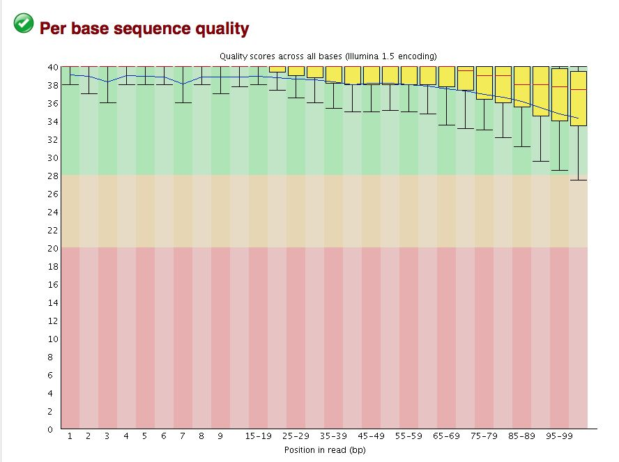
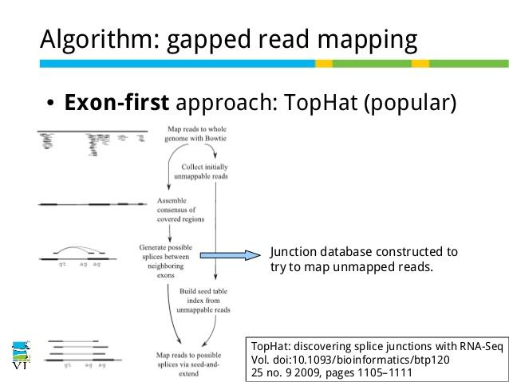
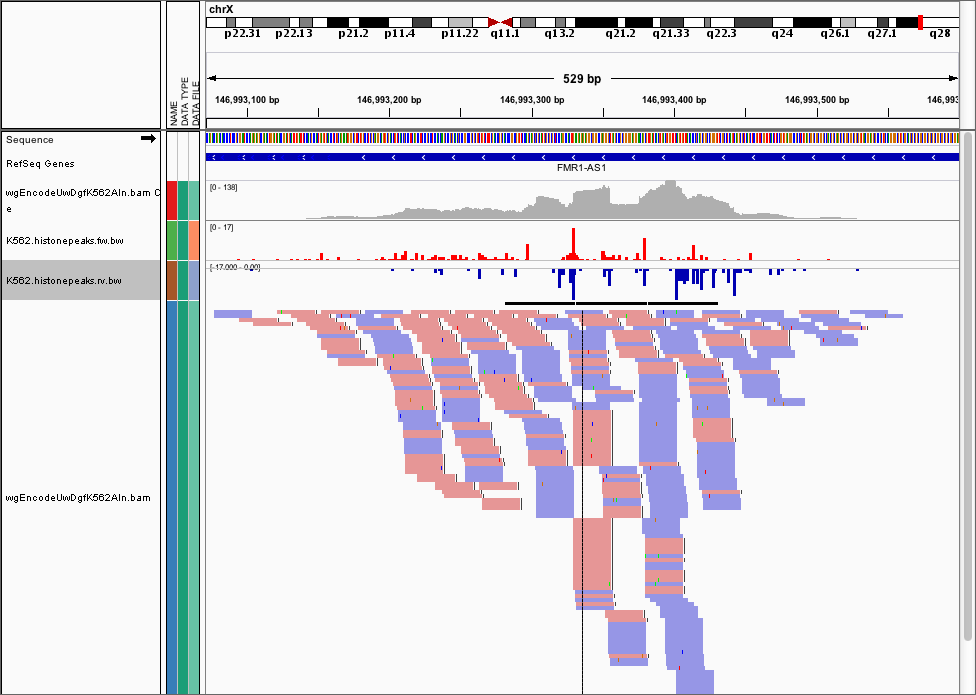

---
title: IIIème workshop du laboratoire BIOMOLIM - Immunoinformatique - Analyse du transcriptome
  par approches haut-débit.
author: 'null'
date: "29 mai au 2 juin - Auditorium de la faculté SNV-TU - Algérie."
output:
  word_document:
    toc: yes
    toc_depth: '4'
  html_document:
    theme: cerulean
    toc: no
    toc_depth: 4
---

 
 

| || |
|----------------- |--|--------------------|
||&nbsp;&nbsp;&nbsp;&nbsp;&nbsp;&nbsp;&nbsp;||

 
 

## Organisateurs

- Dr. Salvatore SPICUGLIA

- Pr. Mourad ARIBI

## Equipe pédagogique

- Salvatore Spicuglia (Chercheur Inserm, TAGC, Marseille)
- Denis Puthier (Maitre de Conférences Aix-Marseille Université, TAGC, Marseille)
- Eve-Lyne Mathieu (Ingénieur de Recherche Inserm, TAGC, Marseille)
- Mohamed Belhocine (doctorant, Aix-Marseille Université, TAGC, Marseille)
- Yasmina Kermezli (doctorante, Université de Tlemcen)
- Wiam Saadi (doctorante, Université de Tlemcen)
- Lynda Klouche
- Djamel Smahi
- Warda Meziane
- Zeyneb Hadjidj
- Zineb Mekkaoui
- Sana Boualitabet Helal

------------------------------------------------------

## Objectifs

Maîtriser les aspects bioinformatiques et expérimentaux de l'analyse  du transcriptome à grande échelle.

- Stimulation d'une lignée lymphocytaire T par traitement PMA/Ionomycine. 
- Analyse bioinformatique des données RNA-seq produites. 
- Validation expérimentale par RT-PCR.

-------------------------------------------------------

## Site Web
Le site web du workshop est disponible sur github à l'adresse suivante:

- http://yasminekzl.github.io/Tlemcen_workshop_2016/index.html

## Programme

Vous trouverez ci-dessous le programme des enseignements. Ils auront lieu chaque jour jusqu'à 18h.

**Dimanche 29 Mai**

|Horaire|Contenu
|----|----
|9h00| Mots d'ouverture (Pr. Mourad)
|9h20| Présentation du workshop et introduction générale (Spicuglia/Mathieu/Puthier)
|10h30| Pause café
|10h45| Introduction à l'étude de l'ARN et les techniques associées (Spicuglia/Puthier)
|12h00| Déjeuner
|13h30| Traitement de données RNA-seq I (Puthier/Belhocine/Kermezli)
|15h15| Pause café
|15h30| Traitement de données RNA-seq II (Puthier/Belhocine/Kermezli)

**Lundi 30 Mai**

|Horaire|Contenu
|----|----
|9h00| Cours théorique sur la régulation épigénétique au cours du développement et des maladies (Spicuglia)
|10h30| Pause café
|10h45| Quantification de l'expression de gènes (Puthier/Belhocine/Kermezli)
|12h00| Déjeuner
|13h30| Identification de gènes différentiellement exprimés I (Puthier/Belhocine/Kermezli)
|15h15| Pause café
|15h30| Visualisation des données RNA-seq (Puthier/Belhocine/Kermezli).

**Mardi 31 Mai**

|Horaire|Contenu
|----|----
|9h00| Cours théorique. LncRNAs| Rôles régulateurs dans le système immunitaire (Mathieu)
|10h30| Pause café
|10h45| Préparation du cDNA (Mathieu/Saadi)
|12h00| Déjeuner
|13h30| Etude de l'expression des gènes par PCR (Mathieu/Saadi)
|15h15| Pause café
|15h30| 

**Mercredi 01 juin**

|Horaire|Contenu
|----|----
|9h00| Analyse de résultats de PCR par électrophorèse sur gel d'agarose (Mathieu/Saadi)
|10h30| Pause café
|10h45| Révélation de résultats (Mathieu/Saadi)
|12h00| Déjeuner
|13h30| Interprétation des résultats de PCR (Mathieu/Saadi)
|15h15| Pause café
|15h30| Etude des Voies de régulation affectées (Puthier/Belhocine/Kermezli)

**Jeudi 02 Juin**

|Horaire|Contenu
|----|----
|9h00| Etude des Voies de régulation affectées (Puthier/Belhocine/Kermezli)
|10h30| Pause café
|10h45| Rédaction d&#39;un rapport synthétique
|12h00| Déjeuner
|13h30| Discussion ouverte
|15h15| Pause café
|15h30| Conclusions
|20h00| Diner de clôture

------------------------------------------------

## Cours théoriques

Les présentations des intervenants sont disponibles sur le site web du worshop.

| Nom | Description  
|-----|------------------------------------------------------
| [Présentation de D. Puthier](slides/rna-seq_2015-polytech.pdf)| Le monde des ARNS. Traitement des données RNA-Seq. 
| [Présentation de S. Spicuglia]() | Régulation épigénétique 
| [Eléments de classification]() | Introduction au clustering.
|[Présentation de Eve-Lyne Mathieu]() | LncRNAs: Rôles régulateurs dans le système immunitaire.
---------------------------------------------

## Phases pratiques

Le matériel pédagogique pour les phases pratiques est disponible sur le site web du worshop.

| Nom |  Concepts traités  | Outils |
|-----|-------------------|--------------------------------------|
| [Tutoriel RNA-Seq](practical/rna_seq_galaxy/rnaseq_td_galaxy.html) | Traitement de données RNA-Seq | Galaxy server, TopHat, FastQC, cufflinks, cuffmerge, IGV, samtool flagstat, UCSC genome Browser, UCSC FTP web site, Ensembl gene search, R...
| [R quick tour](practical/R_first_steps/quick_tour.html) | Opérations de base avec R (réalisée sous forme de démo durant les TP) | R, RStudio |
| [PCR]) | Protocole pour la réalisation d'un RTPCR | PCR, RT-PCR, Electrophorèse...  |

-----------------------------------------------

### Présentation succincte des étapes bioinformatiques

 

1.Récupération des données brutes de séquençage (RNA-Seq) sous forme de fichier *[FASTQ]()*: Le format FASTQ est un format de fichier texte permettant de stocker à la fois des séquences biologiques (uniquement des séquences nucléiques) et les scores de qualité associés.

  

 

2.Controle qualité des *reads* par l'outils [Fastqc](https://usegalaxy.org/root?tool_id=toolshed.g2.bx.psu.edu%2Frepos%2Fdevteam%2Ffastqc%2Ffastqc%2F0.64) de l'UCSC.

 

 

3.Alignement des *reads* contre le génome de référence avec l'outils [Tophat](https://ccb.jhu.edu/software/tophat/index.shtml)

 

 

4.Visualisation de résultats (sous format *[.bam](http://samtools.github.io/hts-specs/SAMv1.pdf)*) (Binary Alignment/Map) avec [IGV](https://www.broadinstitute.org/software/igv/log-in) (Integrated Genome Viewer)

 

 

5.Comptage des *FPKMs* (fragments per kilobase of exon per million fragments mapped) avec [Cufflinks](http://cole-trapnell-lab.github.io/cufflinks/cuffdiff/) en utilisant le genome de référence sous forme d'un fichier [*GTF*](http://www.ensembl.org/info/website/upload/gff.html) (Gene transfer format) 

 

6.Etablir une liste de gènes différentiellement exprimés avec le package DESeq2 sur logiciel R.

 

 

7.Analyse d'enrichissement fonctionnel avec [DAVID](https://david.ncifcrf.gov/).

 

 

8.Validation par PCR des Candidats trouvés.

 

 

-----------------------------------------------

## Ressources web

| Nom | Lien | Description
------------------|------|---------------------------------------------------------------------------
|site web d'Illumina | [https://www.illumina.com/](https://www.illumina.com/)| De nombreuses vidéo de présentation des technologies.|
|site web d'Oxford Nanopore|[https://www.nanoporetech.com/](https://www.nanoporetech.com/)| Présentation du MiION et des ses applications.|
|site web de package Deseq2| [https://bioconductor.org/packages/release/bioc/html/DESeq2.html](https://bioconductor.org/packages/release/bioc/html/DESeq2.html)| Analyse de l'expression différentielle via la distribution binomiale négative.
|Navigateur de génome de l'UCSC |[://genome.ucsc.edu/](https://genome.ucsc.edu/)| Base de données d'information sur les génomes.
|Navigateur de génome Ensembl|[http://www.ensembl.org/](http://www.ensembl.org/)| Base de données d'information sur les génomes.